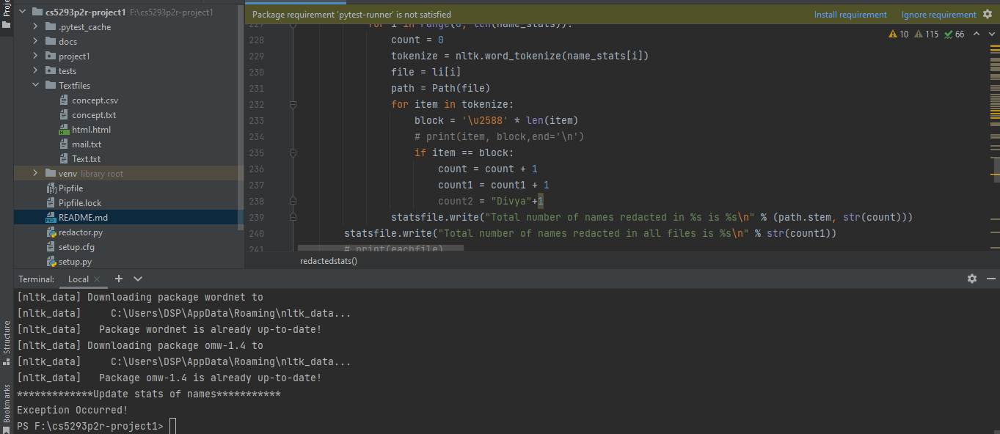

**Name: Divya Sai Pinnamaneni**

**Run Procedure:**

> Install all the below specified libraries using the following command pipenv install modulename.

> Install pipenv using pip install pipenv

> Run the project using  pipenv run python redactor.py --input --names --dates --phones --genders --address --output --concept --stats in which only input,output,stats flags take arguments and the remaining are not mandatory.

> Run testfiles using pipenv run python -m pytest

**Expected bugs**

1. Any other patterns other than specified in this document can't be redacted i encountered in input.
2. With the concept function, no other sentences can be redacted except the words that are acquired using lemma_names, wordnet.synsets functions.

**Libraries used in this project:**

glob, argparse, os.path, re, nltk, numpy, pathlib 

**Project Objective:**

Aim of this project is to build python code for redacting all sensitive information in the provided text files. Primary action would be to hide all sensitive information like names, phones, dates, genders and address in text documents. All sentences that contain the given word through concept flag need to be hidden as well in the text documents as well. To perform these operations I have used below steps.

1. Add arguments like --names, --dates, --phones, --genders, --address, --concept to call them through command line for redacting each kind of information when used.
2. Define each function for hiding each kind of arguments when they appear in the given text files.
3. After completion of redaction process, each redacted file should be transformed into new files with the same name as the given input but with .redacted extension. These files need to be stored in the directory as specified through the argument --output.
4. Using --stats argument, write the statistics of each redacted file.

Two python files are used in this project for performing above steps. One is "redactor.py" and the other is "redactormain.py". redactor.py is used for adding all required arguments to execute through command line and for calling functions that defined in redactormain.py.

Set of text files that required redaction are taken through the argument --input. To extract only text files, use \*.txt at the end of the parent folder. --output flag is used to specify the directory to which the redacted files need to be stored. Redaction flags --names, --genders, --dates, --address, --phones used for redacting entity types from input files. --concept flag can be repeated more than once and this is used to redact sentence when similar concepts or words encountered through concept arguments.
--stats summarizes all redacted items with their count written to a file.

**Dataset used:**
For this project, I have taken four text files from the given Enron Email Dataset and added them to "docs" folder.

****redactormain.py****

**fetchtextdata(input_files):**

This function takes input_files as argument where input_files are nothing but the args used for command line arguments. In this function, all text files from the provided path are taken in to consideration using glob operator. Through try block, each file is opened and tested whether content can be read or not. If there is any exception in reading the contents of the text file an exception is raised through except block and a print statement that file cannot be read with the path of the filename is displayed on the terminal.
Using list li, contents of each file is stored in one of the indexes of li and this function returns a list li containing all text file contents.

Also, through this function try block is used for opening file and reading the content if there are any exceptions occurred those are caught and prints File cannot be read with the file to the console.

**redactnames(text_data):**

This function takes text_data as argument which contains all contents of text files. maskeddata list is used for storing text with redacted names and nameslist is used for storing all names encountered in given files.
Using functions like ne_chunk, pos_tag, word_tokenize from nltk extract Tree structure to get traverse through and find the token which has label PERSON for recognizing names and append all found names to a list. Whenever a name in this list is encountered in the original text file, replace it with the block character "\u2588". This function returns all text files masked with names.

**redactgenders(text_data):**

if --genders used in command line while execution through command line then this function is called to redact any term that reveals gender of an entity. This function takes text_data as an input argument which contain all text information. A list called genderentity is defined with list of words that reveal a gender and I have used following words in this genderentity list ['father','mother','daddy','mummy','businessman','businesswoman','she','he','him','her','Mr.','Ms.','his','hers','son','daughter','sister','brother','woman','man','men','women','sir','madam','king','queen','uncle','aunt','nephew','niece','husband','wife','lord','lady','himself','herself','dad','mom','grandfather','grandmother','grandson','granddaughter','boy','girl','boys','girls','boyfriend','girlfriend','hero','heroine','gentleman','gentlemen','emperor','empress'. Each word from textile is taken using word_tokenize function and scanned if any of the words from genderentity encountered. I have used lower function because my genderentity list is in lower case and I'm appending gender words only if they are not available in the extractgenders. Then, extractgenders list is sorted so that not to miss masking any higher length words for example, mother doesn't get masked if we don't sort the list in descending order because mother contain 'he' which may be masked before resulting in skipping redacting the word 'mother'. All the extractgenders are replaced with "\u2588" in the original textfile.This function returns maskedgender which masks all gender related words in the text files.

**redactdates(text_data):**

If --dates argument used in command line execution, then this function is called to redact all date patterns defined here. It takes text_data as input argument which contains all text information. Using regex, all below patterns of dates are identified and replaced with \u2588 if encountered in given text files.
* YYYY.MM.DD , YYYY-MM-DD, YYYY/MM/DD, YYYY.DD.MM, YYYY-DD-MM, YYYY/DD/MM, YY.MM.DD, YY-MM-DD, YY/MM/DD, YY.DD.MM, YY-DD-MM, YY/DD/MM and DD can be D, MM can be M.
* MM-DD-YYYY, MM/DD/YYYY, DD-MM-YYYY, DD/MM/YYYY and YYYY can be YY, DD can be D, MM can be M sometimes.
* (\d{1,2}\s(?:January|February|March|April|May|June|July|August|September|October|November|December|Jan|Feb|Mar|Apr|Jun|Jul|Aug|Sep|Oct|Nov|Dec)(?:,\s|\s)\d{2,4})
* (?:January|February|March|April|May|June|July|August|September|October|November|December|Jan|Feb|Mar|Apr|Jun|Jul|Aug|Sep|Oct|Nov|Dec)\s\d{1,2}(?:,\s|\s)\d{2,4})
* (?:January|February|March|April|May|June|July|August|September|October|November|December|Jan|Feb|Mar|Apr|Jun|Jul|Aug|Sep|Oct|Nov|Dec)\s\d{1,2})
* (\d{1,2}-(?:May|Jan|Feb|Mar|Apr|Jun|Jul|Aug|Sep|Oct|Nov|Dec)-\d{2,4})
* ((?:January|February|March|April|May|June|July|August|September|October|November|December|Jan|Feb|Mar|Apr|Jun|Jul|Aug|Sep|Oct|Nov|Dec)\s\d{1,2}(?:st|nd|rd|th)(?:,\s|\s)\d{2,4})
* (\d{1,2}(?:st|nd|rd|th)\s(?:January|February|March|April|May|June|July|August|September|October|November|December|Jan|Feb|Mar|Apr|Jun|Jul|Aug|Sep|Oct|Nov|Dec)(?:,\s|\s)\d{2,4})
* (?:January|February|March|April|May|June|July|August|September|October|November|December|Jan|Feb|Mar|Apr|Jun|Jul|Aug|Sep|Oct|Nov|Dec)\s\d{1,2}(?:st|nd|rd|th))
* (\d{1,2}(?:st|nd|rd|th)\s(?:January|February|March|April|May|June|July|August|September|October|November|December|Jan|Feb|Mar|Apr|Jun|Jul|Aug|Sep|Oct|Nov|Dec))
This function returns all textfiles with hidden dates in it.

**redactphones(text_data):**

This function is executed with the --phones flag received through command line argument. It takes text_data as input which holds all text files content. If any of the below phone patterns found, it gets replaced with block character '\u2588'.

- +1 (405) 405-4050,+(405) 405-4050
- 405 405 4050, 405 405.4050, 405 405-4050
- 1-405-405-4050, 1-405.405.4050, 1-405 405 4050
- 405-4050
- (405) 405-4050, (405) 405.4050, (405) 405 4050
This function returns text_data with hidden phonenumbers.

**redactaddress(text_data):**

This function is called if --address flag is used in the command line argument. It takes text_data with all text files information as input and if any of the below pattern address is encountered in the text files,it replaces address with the block character '\u2588'.
+ 660 Parrington Oval, Norman, OK 73019
+ 660 Parrington

  Oval, Norman, OK 73019
+ 660 Parrington, Oval

  university of oklahoma

  Norman, OK 73019
+ 660 Parrington Oval
 
  Norman, OK 73019

This function returns text files with the hidden addresses.

**outputredactedfiles(input_files, text_data):**

This function takes two arguments one is input_files for retrieving all args and the other text_data for retrieving all text files. It is executed on --output flag which writes all redacted text to new files with name of the file being same as original filename but with .redacted extension. Additionally, it also checks whether the given output directory exists or not. If directory not available, creates a new directory in the given path. This doesn't return anything but just write redacted text to new files.

**redactconcept(input_files, text_data):**

This function takes two arguments one is input_files for retrieving all args and the other text_data for retrieving all text files. It is executed on using --concept lag in command line execution. All similar words are extracted using the functions wordnet.synsets(), lemma_names(). Then by using sent_tokenize and word_tokenize if any similar word from the list encountered in text file then sentence containing that concept word is hidden using block character '\u2588'.
This function returns text_data with the hidden sentences which contain word related to concept. 

**redactedstats(input_files,text_stat):**

This function takes two arguments one is input_files which is nothing but all arguments passed through command line for execution and the other argument is text_stat which takes all text files information. This function prints the counts of all redacted names, genders, phones, address, dates, concept to a filename provided through the --stats argument through command line. Also, this function is executed for another two special cases like stdout, stderr. If --stats arguments takes any of the stdout, stderr then all redacted items count is print to the console.  So stats take either a filename or specialfiles-stdout, stderr.
So, I have used if, elif and else to check stdout, stderr and filename respectively. And then print count of each redacted item along with total items redacted in all files to console for stdout, stderr but write to a filename instead of printing to the console when filename is used for --stats.

In the below image, I have just tried to perform addition of string with integer which lead to print exception written in except block. But in my original program this statement wouldn't be available as it causes execution error.

For both stdout, stderr output is printed to console only. try and except block used to check for any exceptions. When a filename given, a file with the given name is created and written all redacted stats into it. In my project structure, stats ile is used for printing output to that file. 

****redactor.py****

Add all the arguments using argparse add_argument. Out of all arguments input, output and stats always takes value. names, dates, phones, address, genders doesn't take value so used action=store_true which gives value True when argument exists. As input and concept flags may be repeated more than once, action = append is taken to consider all values.
Each function defined in redactormain.py file is called in this file and assigned to same variable to make the program run for any number of given arguments like skipping any of the flags.

****Testcases****

Each function defined in redactormain file is tested using pytests.

**test_fetchtextdata.py**

To test fetchtextdata function, a default path is taken as input i.e. "../cs5293p2r-project1/docs/*.txt" which contains 4 textfiles and checks whether the output of function is list or not.

**test_names.py**

This file is used to test redactnames function. For this a default path is provided and all text files in that path are read and called original redactnames function. Finally, using assert tests whether output of redactnames function has data or not.

**test_genders.py**

This function is used to test redactgenders function. For this a default path is provided and all text files in that path are read and called original redactgenders function. Finally, using assert tests whether output of redactgenders function is returning list or not.

**test_redactphones.py**

This file is used to test redactphones function. For this a default path is provided and all text files in that path are read and called original redactphones function. Finally, using assert tests whether output of redactphones function has data or not.

**test_redactdates.py**

This function is used to test redactdates function. For this a default path is provided and all text files in that path are read and called original redactdates function. Finally, using assert tests whether output of redactdates function is returning list or not.

**test_redactaddress.py**

This file is used to test redactaddress function. For this a default path is provided and all text files in that path are read and called original redactaddress function. Finally, using assert tests whether output of redactaddress function has data or not.

**test_redactconcept.py**

This function is used to test redactconcept function. For this a default path is provided and all text files in that path are read and called original redactconcept function. Finally, using assert tests whether output of redactconcept function is returning list or not.

**test_outputiles.py**

In this function my outputfiles and stats file path are provided and checked whether it contains data or not.

